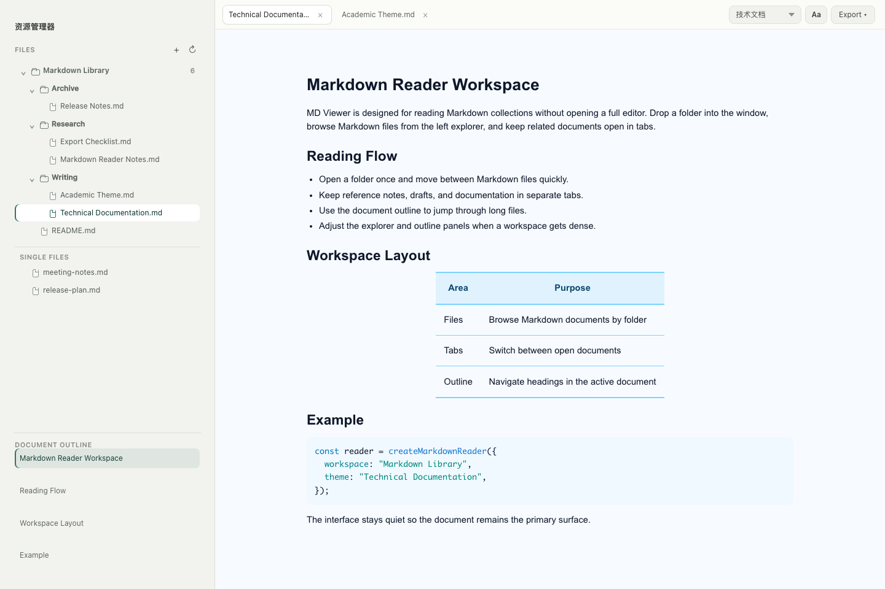
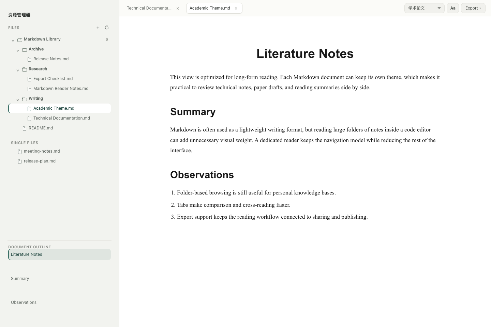
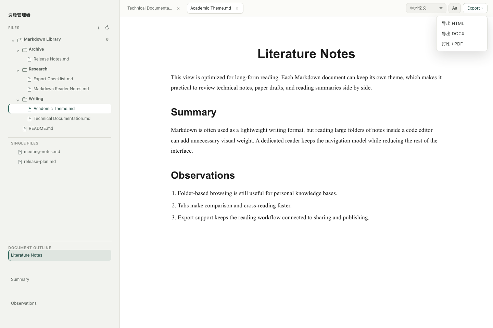

# MD Viewer

一个专门用来阅读 Markdown 文档的轻量桌面应用。

这个项目的出发点很简单：VS Code 很强，也很好用，但如果只是想打开一个目录、翻阅里面的 Markdown 文档，它还是显得太重了。MD Viewer 把 Markdown 阅读这件事单独拆出来，保留类似编辑器的目录浏览、标签页和大纲体验，但把界面和操作都收敛到“阅读”本身。

## 项目由来

这个项目的灵感来自 [markdown-viewer-extension](https://github.com/markdown-viewer/markdown-viewer-extension)。原项目提供了很好的 Markdown 预览和主题体验，也给了我把 Markdown 阅读能力独立出来的想法。

感谢 [markdown-viewer-extension](https://github.com/markdown-viewer/markdown-viewer-extension) 原仓库作者的工作。这个项目不是为了替代原项目，而是基于自己的使用场景做的一次重新整理：当目标只是阅读 Markdown 时，应用应该更轻、更直接，也更像一个专门的文档阅读器。

## 功能

- 拖入 Markdown 文件直接阅读
- 拖入目录后，以类似 VS Code Explorer 的方式浏览目录下的 Markdown 文件
- 支持多个文档标签页
- 每个标签页可以保留独立主题
- 支持文档大纲跳转
- 支持主题字号调整
- 支持导出 HTML、DOCX，以及打印 / PDF
- 支持侧边栏和目录区域拖拽调整大小
- 支持在 Finder 中显示文件或目录

## 截图







## 开发

```bash
pnpm install
pnpm tauri dev
```

构建本地安装包：

```bash
pnpm tauri build
```

## 技术栈

- Tauri 2
- Vite
- Vanilla JavaScript
- Markdown-it

## 致谢

感谢 [markdown-viewer-extension](https://github.com/markdown-viewer/markdown-viewer-extension) 原仓库作者。这个项目的主题体验和 Markdown 阅读方向都受到了它的启发。
